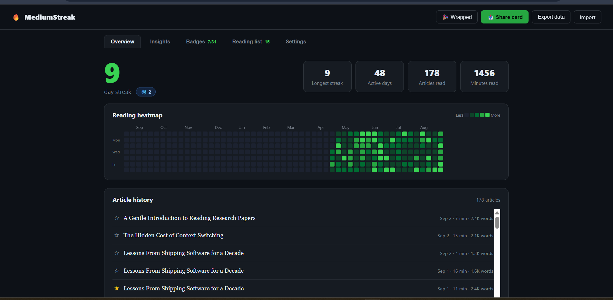
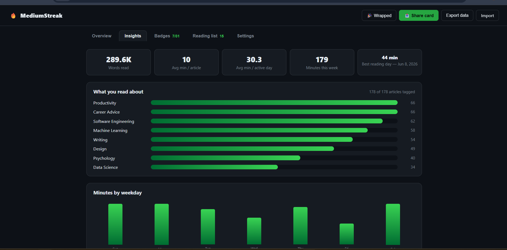
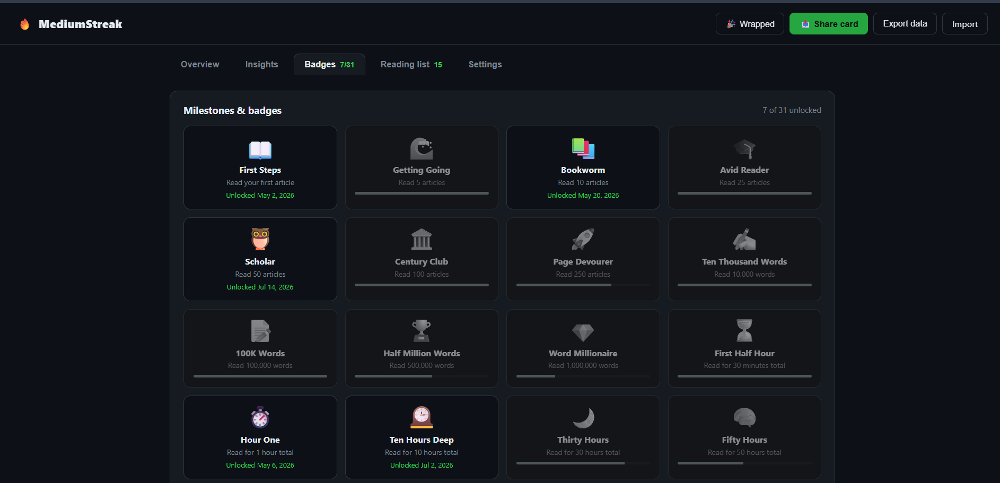
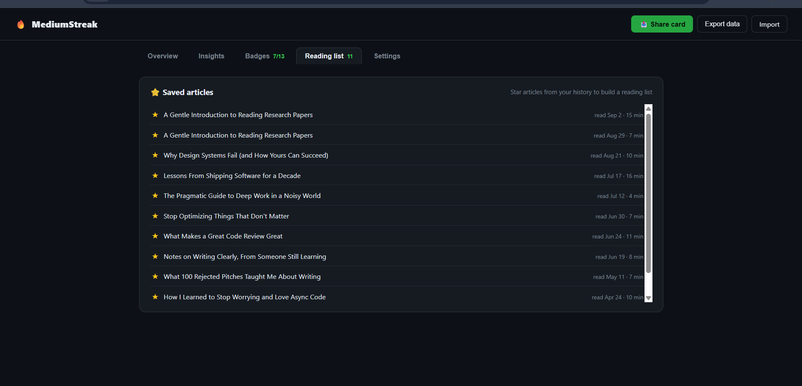
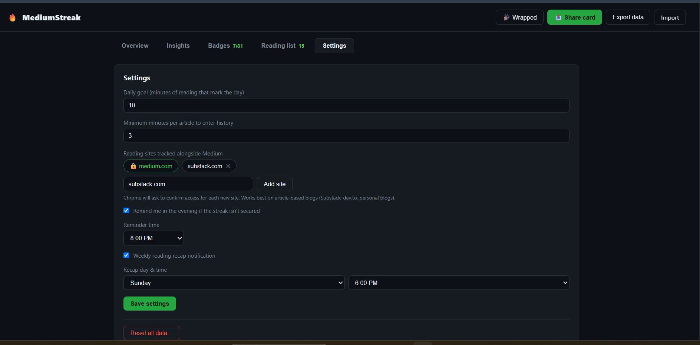
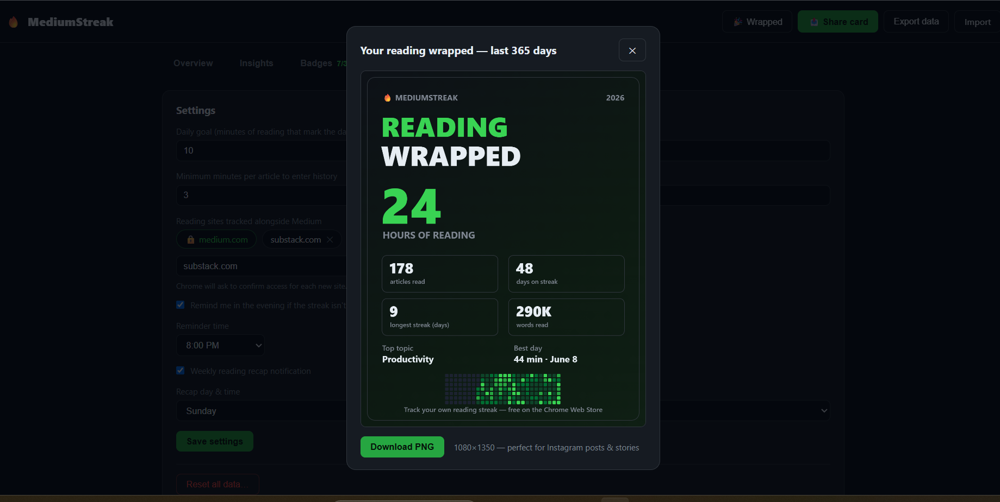

# MediumStreak 🔥

📦 Chrome Web Store:
https://chromewebstore.google.com/detail/hmhmagoboicnijknllomkennbappehei

A privacy-first Chrome extension that turns reading on Medium and sites you add into a streak with heatmaps, badges, and reading insights. Each day lights up based on minutes you actually read, with streak counters, article history, insights, badges, and more.

All data stays **local** on your device (`chrome.storage`) unless you explicitly export or share it. No accounts, no servers.

---

## How it works

- While you have an article open on Medium or a site you added in Settings, the extension counts
  *active* reading time: tab visible + window focused + you interacted with a scroll,
  wheel, or keyboard gesture within the last 60 s. Walk away and the clock pauses.
- A day counts toward the streak once your **daily goal** (default 10 min) is met.
- Articles you read for at least 3 minutes land in your **history**.
- Miss a day? A **streak freeze** ❄️ (earned for every 7-day streak) covers it
  automatically — Duolingo-style.
- Optionally get an evening **notification** if today's streak isn't secured yet.

## Getting started

1. Install the extension and open the Dashboard.
2. Start reading on Medium; it is included automatically.
3. To track another website, open **Settings**, enter its domain, and click **Add site**.
4. Approve Chrome's site-access request. The website will then appear as a tracked site.
5. Use the **✕** button on an added site to stop tracking it. Its existing history is kept.

## Features

### 📊 Streaks & tracking
- **Active-reading tracking** on Medium and sites you add in Settings (visible tab + focus + recent meaningful interaction)
- **Streak heatmap** — popup mini view and a full-year dashboard view, with current/longest streak stats
- **Streak freeze** ❄️ — earn one per 7-day streak; missed days are auto-covered
- **"Streak secured" celebration** 🔥 — the moment you cross your daily goal mid-article, the page shows a toast + confetti (once per day)
- **Multi-site support** 🌐 — Medium is the only built-in site. Add any other blog, publication, or news website in Settings when you want to track it.

### 🔔 Notifications
- **Evening reminder** notification (opt-in) when today's streak isn't secured
- **Weekly recap** notification 📊 — minutes read, active days, and streak for the last 7 days (day/time configurable)

### 🏆 Milestones & insights
- **Milestones & badges** — 31 badges across streaks, articles, hours, and words, with unlock notifications and progress bars
- **Reading insights** — words read, avg minutes per article/active day, best day, and weekday / 12-week / 12-month bar charts
- **Topics breakdown** 🏷️ — captures article tags, JSON-LD topics, and metadata keywords across tracked sites

### 🔖 Reading list
- **Read later queue** — right-click any link anywhere → "Save to MediumStreak read later," managed in the Reading list tab
- **Reading list** ⭐ — star articles from history to save them (starred ones survive pruning)

### 📤 Sharing
- **Share card** — generates a 1200×630 PNG of your streak + heatmap for social
- **Reading Wrapped** 🎉 — a 1080×1350 "year in reading" card (hours, streaks, top topic) to post

### ⚙️ Everything else
- **Rating prompt** — appears once after 5 active days (never nags; "later" re-asks after 30 days). Set your store URL in `lib/config.js`.
- **Export / import** — JSON backups of your local reading data, settings, badges, and saved items

---

## Screenshots

### Insights
Words read, per-article/per-day averages, topic breakdown, and reading-by-weekday charts.

### Badges
31 milestones across streaks, articles, hours, and words read, with unlock dates and progress bars.

### Reading list
Read-later queue plus starred articles saved from your history.

### Settings
Daily goal, minimum minutes to log an article, tracked sites, reminders, and the weekly recap schedule.

### Reading Wrapped
A shareable "year in reading" card — hours read, articles, streaks, top topic, and best day.

---

## Roadmap ideas (v1.2+)

- Share card: copy-image-to-clipboard button + open-in-tab preview
- More configurable article-site profiles
- Optional cloud sync for users who explicitly opt in

- Friend leaderboards — opt-in groups via invite code (max ~10 friends), Duolingo-style
      *weekly* league that resets every Sunday, sharing only streak + weekly minutes
      (needs a tiny backend — Cloudflare Worker + KV)

- Hourly reading rhythm chart ("you read most at 10pm")

